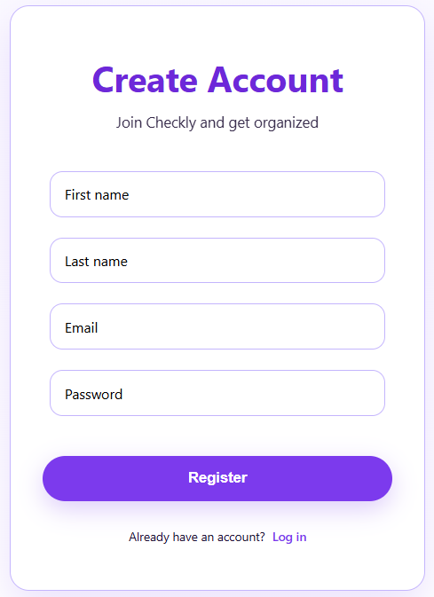
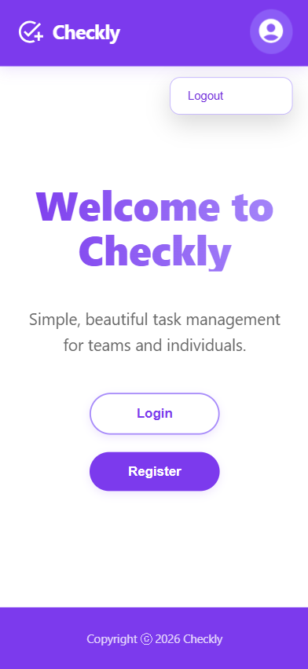
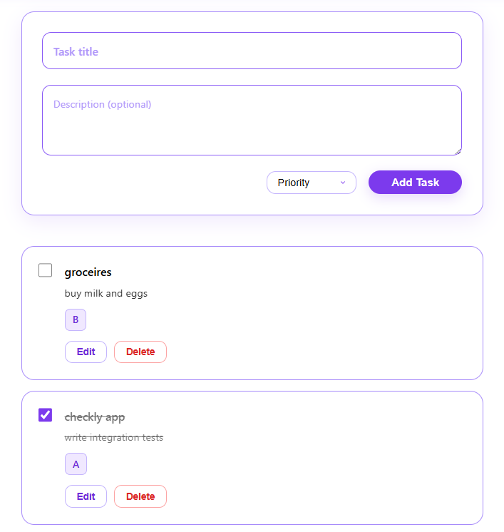

# Checkly - Todo App

A full-stack todo list application with user authentication, secure sessions, and REST API.

## Screenshots

### 1. Register / Auth Page
  
Google OAuth login screen with clean, modern design.

### 2. Home Page
  
Main view showing user's tasks with add, edit, complete, and delete functionality.

### 3. Adding / Editing Tasks
  
Form for creating or updating todos with title, description, and priority.


## Features
- User Authentication
- Secure session management (express-session)
- CRUD operations: Add, edit, delete, and list todos
- Protected API routes
- CORS configured for local dev

## Tech Stack
- **Backend**: Node.js + Express
- **Auth**: Passport.js
- **Session**: express-session
- **Frontend** : React + Vite 
- **Testing**: Jest

## Setup (Local Development)

1. Clone the repo
```bash
git clone https://github.com/zakiayoubi/checkly.git

Backend

npm start — run production server
npm run dev — run with nodemon (recommended)

Frontend

npm start — development server
npm run build — create production build
